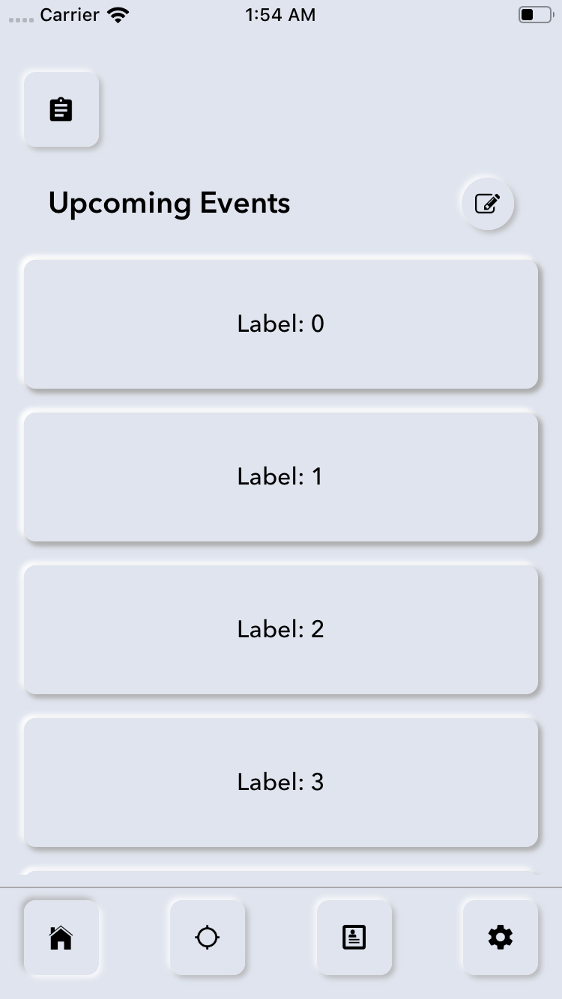
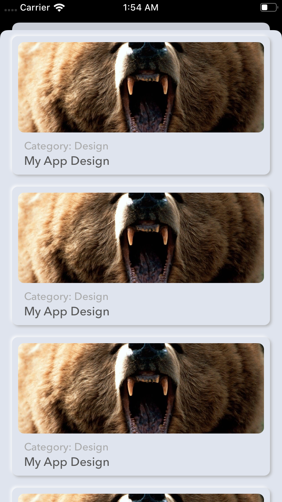
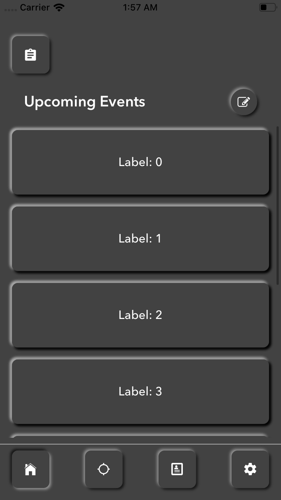
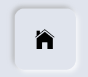

## Introduction

Hi, Humans!

My name is Hamza Farooq and I love 'Swift' programming. I always try to implement new ideas, so here is another glimps of one of my new work for you. Do check [HFLoader](https://github.com/hamza-faroooq/HFLoader) also... :-)

## HFSoftUI

A simple and short extension for Neumorphic Effect in Swift (also know as SoftUI). Try this new effect in your projects and enhance the UI experience.

### Light Color Scheme



### Dark Color Scheme



## Example

To run the example project, clone the repo, and simply run [HFSoftUI.xcodeproj](https://github.com/hamza-faroooq/HFSoftUI/tree/master/HFSoftUI) from the 'HFSoftUI' directory.

## Simple Usage

Do the following simple steps to make an awesome [Neumorphic Effect](https://github.com/hamza-faroooq/HFSoftUI).

Simply download and place the file named [HFSoftUI.swift](https://github.com/hamza-faroooq/HFSoftUI/tree/master/HFSoftUI/HFSoftUI/Supporting%20Files) in your project anywhere. (Click on this link, this will take you to the directory where HFSoftUI file is placed)

Now let's suppose we have a [View](https://developer.apple.com/documentation/uikit/uiview) and a [Button](https://developer.apple.com/documentation/uikit/uibutton) in your [ViewController](https://developer.apple.com/documentation/uikit/view_controllers):

```swift
@IBOutlet weak var myView: UIView!
@IBOutlet weak var myButton: UIButton!

let HFSoftUIColor = #colorLiteral(red: 0.8745098039, green: 0.8941176471, blue: 0.9333333333, alpha: 1) // for light color scheme
// let HFSoftUIColor = #colorLiteral(red: 0.2605174184, green: 0.2605243921, blue: 0.260520637, alpha: 1) // for dark color scheme

```

You can apply Neumorphic Effect as follows:

* For UIView

```swift
myView.HFSoftUIView(backgroundColorValue: HFSoftUIColor)
```

* For UIButton

```swift
myButton.HFSoftUIButton(backgroundColorValue: HFSoftUIColor)
```

And that's it. Your eyes will witness a nice Neumorphic Effect, (Well... Maybe not yet. :-D). Let's dive deeper to get things working.

First thing to keep in mind that your color scheme must matches for the Neumorphic Effect to appear properly on your mobile screen. secondly, add the above line of code in your controller's [viewDidAppear()](https://developer.apple.com/documentation/uikit/uiviewcontroller/1621423-viewdidappear) as:

```swift
override func viewDidAppear(_ animated: Bool) {
        super.viewDidAppear(animated)
        
        self.view.backgroundColor = HFSoftUIColor
        myView.HFSoftUIView(backgroundColorValue: HFSoftUIColor)
        myButton.HFSoftUIButton(backgroundColorValue: HFSoftUIColor)
        
    }
```

This will create light color scheme Neumorphic Effect as shown in [First Screen Shot](ScreenShots/LightColorSchemeScreenShot1.png)

NOTE: You have to write this in viewDidAppear rather than [viewDidLoad()](https://developer.apple.com/documentation/uikit/uiviewcontroller/1621495-viewdidload) or [viewWillAppear()](https://developer.apple.com/documentation/uikit/uiviewcontroller/1621510-viewwillappear) because the extension uses view's frame to apply shadow, and that frame is not yet known at the time of viewDidLoad and viewWillAppear. So its better to use viewDidAppear.

## Advance Usage

You can use HFSoftUI for [TableView](https://developer.apple.com/documentation/uikit/uitableview) as well as [CollectionView](https://developer.apple.com/documentation/uikit/uicollectionview). The word 'Advance' is just to scare you. Just write below lines of code in your [cellForRowAt](https://developer.apple.com/documentation/uikit/uitableviewdatasource/1614861-tableview) for TableView and [cellForItemAt](https://developer.apple.com/documentation/uikit/uicollectionviewdatasource/1618029-collectionview) for CollectionView:

```swift
DispatchQueue.main.async {
               cell.myView.HFSoftUIView(backgroundColorValue: HFSoftUIColor)
        }
```

## Change Properties / Customization

You can adjust/customize HFSoftUI. These are some properties that you can play with to change its appearance:

* cornerRadius
* backgroundColor
* shadowRadius
* shadowOpacity
* isDarkColorScheme
* isUpperWhiteRequired

### Example 1:

This will create round button with Neumorphic Outward Effect

```swift
self.myButton.HFSoftUIButton(backgroundColorValue: HFSoftUIColor, cornerRadiusValue: self.myButton.frame.height / 2)
```


Now Set isDarkColorScheme to 'true'

```swift
self.myButton.HFSoftUIButton(backgroundColorValue: HFSoftUIColor, cornerRadiusValue: self.myButton.frame.height / 2, isDarkColorScheme: true)
```


### Example 2:

This will create corner button with Neumorphic Outward Effect

```swift
self.myButton.HFSoftUIButton(backgroundColorValue: HFSoftUIColor)
```


Now Set isDarkColorScheme to 'true'

```swift
self.myButton.HFSoftUIButton(backgroundColorValue: HFSoftUIColor, isDarkColorScheme: true)
```


### Example 3:

This will create corner button with Neumorphic Intward Effect

```swift
self.myButton.HFSoftUIButton(shadowRadiusValue: -2.0, backgroundColorValue: HFSoftUIColor)
```



Now Set isDarkColorScheme to 'true'

```swift
self.myButton.HFSoftUIButton(shadowRadiusValue: -2.0, backgroundColorValue: HFSoftUIColor, isDarkColorScheme: true)
```


## Key Notes

You can set isDarkColorScheme to 'true' or 'false' depending upon your color scheme. You can also set isUpperWhiteRequired to 'true' or 'false' depending upon your color scheme. Play with these two variables to achieve better results. If you are using dark scheme, and still Neumorphic Effect is not appearing properly, make isUpperWhiteRequired property true, fingers crossed... :-D // NOTE TAHT Neumorphic Effect WILL NOT APPEAR ON EVERY COLOR SCHEME -_-

## Contributions

Your contributions are most welcomed. Do let me know if you find any kind of issue while using this file. Please open an issue to discuss that problem. Thanks

## Auther

Hamza Farooq, hamza_faroooq@yahoo.com

## License

[MIT](https://github.com/hamza-faroooq/HFSoftUI/blob/master/LICENSE) (Click Me O_o)
